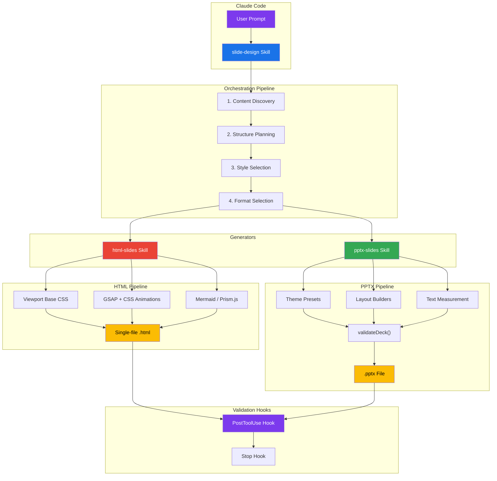
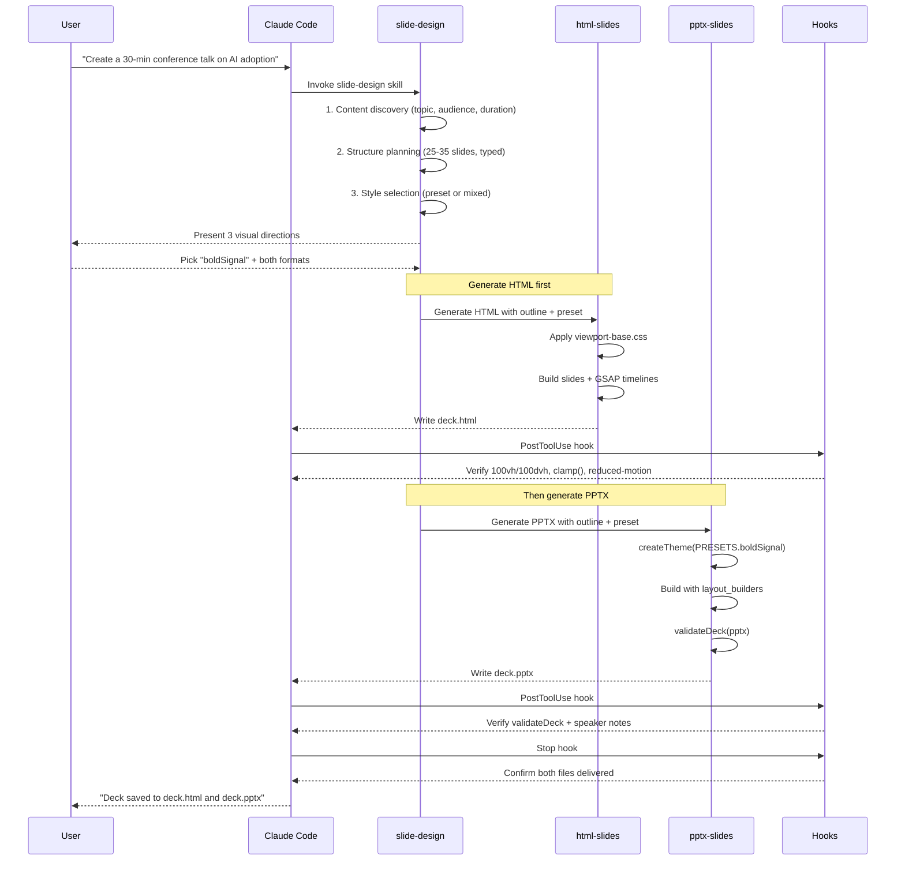

# Slides AI Plugin

[](LICENSE)
[](https://code.claude.com/docs/en/plugins)
[](#supported-formats)
[](#style-presets)
[](https://bun.sh)


https://github.com/user-attachments/assets/3c7250dd-59d7-4eea-835b-12a3c0871bb3

**Turn any idea, outline, or existing deck into a professional presentation — straight from Claude Code.** Generate animated HTML decks (GSAP + CSS, single-file, viewport-fitted) or fully editable PowerPoint (`.pptx`) files with 12 curated style presets, adaptive typography, layout validation, and speaker notes — just ask Claude.

---

## Quick Start

### Installation

#### Option 1: CLI Install (Recommended)

Use [npx skills](https://github.com/vercel-labs/skills) to install skills directly:

```bash
# Install the skill
npx skills add proyecto26/slides-ai-plugin

# List available skills
npx skills add proyecto26/slides-ai-plugin --list
```

This automatically installs to your `.claude/skills/` directory.

#### Option 2: Claude Code Plugin

Install via Claude Code's built-in plugin system:

```bash
# Add the marketplace
/plugin marketplace add proyecto26/slides-ai-plugin

# Install the plugin
/plugin install slides-ai-plugin
```

#### Option 3: Clone and Copy

Clone the repo and copy the skills folder:

```bash
git clone https://github.com/proyecto26/slides-ai-plugin.git
cp -r slides-ai-plugin/skills/* .claude/skills/
```

#### Option 4: Git Submodule

Add as a submodule for easy updates:

```bash
git submodule add https://github.com/proyecto26/slides-ai-plugin.git .claude/slides-ai-plugin
```

Then reference skills from `.claude/slides-ai-plugin/skills/`.

#### Option 5: Fork and Customize

1. Fork this repository
2. Customize skills, presets, and helpers for your brand
3. Clone your fork into your projects

### Generate Your First Deck

Just describe what you want:

> *"Create a 15-minute conference talk about AI adoption for engineering teams, with a bold editorial style — both HTML and PPTX."*

That's it — the skill handles everything: content discovery, structure planning, style selection, slide generation, and validation. Outputs land in your working directory as `.html` and/or `.pptx` files.

---

## Features

### Orchestrated Pipeline

The `slide-design` skill drives the full workflow from raw idea to validated deck. It handles:

1. **Content discovery** — topic, audience, duration, tone, existing content
2. **Structure planning** — duration-indexed slide count with tagged slide types
3. **Style selection** — pick from 12 curated presets or mix backgrounds per section
4. **Format selection** — HTML, PPTX, or both
5. **Generation** — delegates to `html-slides` or `pptx-slides`
6. **Validation** — density limits, speaker notes, overlaps, viewport fitting

### Supported Formats

| Format | Output | Best For | Key Capabilities |
|:-------|:-------|:---------|:-----------------|
| **HTML** | Single `.html` file | Conference talks, web sharing, live demos | GSAP timelines, CSS animations, viewport fitting, Mermaid diagrams, inline video, `contenteditable` live edit |
| **PPTX** | OOXML `.pptx` | Corporate sharing, offline editing, templates | Native text boxes, editable shapes, speaker notes, master layouts, adaptive font sizing |

### Duration-Indexed Structure

| Duration | Slides | Structure |
|:---------|:-------|:----------|
| 5 min (Lightning) | 5-7 | Hook → 2-3 key points → CTA |
| 15 min (Short talk) | 12-18 | Intro → 3-4 sections → Summary → CTA |
| 30 min (Conference) | 25-35 | Title → Agenda → 5-6 sections → Q&A |
| 45 min (Keynote) | 35-50 | Title → Agenda → 7-8 sections → Summary → CTA |
| 60 min (Workshop) | 40-60 | Title → Agenda → Sections with exercises → Wrap-up |

### Slide Type Vocabulary

Every slide is tagged with a type — the generator picks the right template and density rules:

`title`, `section-divider`, `content`, `image-focus`, `comparison`, `quote`, `code`, `feature-grid`, `timeline`, `metrics`, `meme-gif`, `diagram`, `demo-divider`, `audience-question`, `closing`.

### Style Presets

12 curated visual identities with typography pairs, color palettes, and signature elements:

`darkMonospace`, `swissModern`, `boldSignal`, `darkBotanical`, `cleanCorporate`, `neonCyber`, `warmMinimal`, `vintageEditorial`, `terminalGreen`, `gradientWave`, `midnightBlue`, `paperInk`.

Mix presets across sections for multi-mood decks (e.g., cream for content, black for demos, accent color for section dividers).

### HTML Generation Highlights

- **Single-file, zero runtime deps** — inline CSS/JS, no build step
- **Viewport-fitted** — every slide locks to `100vh`/`100dvh` with `overflow: hidden`, `clamp()` typography
- **GSAP animations** — timelines, SplitText, ScrollTrigger, spring physics (Remotion-inspired damping presets)
- **CSS-first fallback** — animations work with JS disabled via staggered `.reveal` classes
- **Accessibility** — `prefers-reduced-motion` respected, semantic HTML
- **Mermaid + Prism.js** — flowcharts, sequence diagrams, syntax-highlighted code
- **Inline edit mode** — `contenteditable` attributes let users tweak text in the browser

### PPTX Generation Highlights

- **PptxGenJS + Bun** — TypeScript helpers run with `npx -y bun`, no build step
- **skia-canvas text measurement** — `autoFontSize()` fits paragraphs to exact boxes; `scale()` is the PPTX equivalent of CSS `clamp()`
- **Layout validators** — overlap detection, bounds checking, alignment/distribution helpers
- **High-level builders** — `addFeatureGrid()`, `addCardRow()`, `addTimeline()`, `addMetricsRow()`, `addComparisonTable()`
- **Decorative personality** — `addStaircase()`, `addSectionBadge()`, `addProgressBar()`, `addSlideNumber()`
- **Syntax highlighting** — `codeToRuns()` converts Prism.js tokens into PptxGenJS text runs
- **Pre-save validation** — `validateDeck()` enforces font minimums, bullet caps, speaker notes, boundaries
- **Editable by design** — native text boxes, native shapes, grouped elements, speaker notes on every content slide

### Automatic Validation Hooks

Built-in `PostToolUse` and `Stop` hooks inspect every generated file:

- PPTX → verifies `h.validateDeck()` was run and speaker notes exist
- HTML → verifies viewport CSS (`100vh`/`100dvh`), `prefers-reduced-motion`, and `clamp()` typography
- Stop → blocks task completion if slides were requested but not delivered with speaker notes

### PPTX → HTML Conversion

Bring legacy decks into the modern web:

```bash
python ${CLAUDE_PLUGIN_ROOT}/skills/html-slides/scripts/extract-pptx.py deck.pptx
```

Extracts text, images, and speaker notes into JSON — then the `slide-design` skill rebuilds it as an animated HTML presentation with your chosen style preset.

---

## Usage Examples

Just describe what you need to Claude — the `slide-design` orchestrator triggers automatically:

**"I need to create slides for my 30-min conference talk on AI adoption for engineering teams"**
> Runs content discovery → structure planning → style selection → generates both HTML and PPTX.

**"Convert this PPTX into an interactive HTML deck with GSAP animations"**
> Extracts text/images/notes from the `.pptx`, rebuilds as a single-file animated HTML with viewport fitting.

**"Turn my markdown outline into a pitch deck with the boldSignal style"**
> Applies the `boldSignal` preset, maps bullets to slide types, generates `.pptx` with validation.

**"Create a 5-minute lightning talk with meme-driven tone and a mixed-background deck"**
> Structures 5-7 slides, alternates backgrounds per section, injects meme/GIF slides.

**"Generate a corporate pitch deck (PPTX only) with editable shapes and speaker notes"**
> Uses `cleanCorporate` preset, native shapes for diagrams, `slide.addNotes()` on every content slide.

**"Build a workshop deck with code slides, timelines, and feature grids"**
> Applies density limits, splits long content automatically, uses `addTimeline()` / `addFeatureGrid()` / `codeToRuns()`.

---

## Configuration

### Per-Project Overrides

Create `.claude/slides-ai-plugin.local.md` in your project to override defaults. The orchestrator reads YAML frontmatter from this file:

```markdown
---
default_format: pptx
default_preset: darkMonospace
default_language: en
speaker_notes_style: conversational
aspect_ratio: 16:9
---
```

### Environment Variables

| Variable | Description |
|:---------|:------------|
| `CLAUDE_PLUGIN_ROOT` | Plugin install root (auto-set by Claude Code; used to resolve bundled scripts) |
| `CLAUDE_SKILL_DIR` | Active skill directory (auto-set; used to resolve `references/` paths) |

### Runtime Dependencies

Dependencies are auto-installed on first run — no manual setup required:

| Runtime | Why |
|:--------|:----|
| **Bun** (via `npx -y bun`) | Runs PPTX TypeScript helpers without a build step |
| **pptxgenjs** | OOXML `.pptx` generation |
| **skia-canvas** | Font-aware text measurement for `autoFontSize()` |
| **fontkit, linebreak** | Typography metrics and line-breaking |
| **prismjs** | Syntax highlighting (shared between HTML and PPTX paths) |
| **python3 + python-pptx** | PPTX → HTML conversion (`extract-pptx.py`, only needed for PPTX import) |

---

## Project Structure

```
slides-ai-plugin/
├── .claude-plugin/
│   ├── plugin.json                  # Plugin manifest
│   └── marketplace.json             # Marketplace metadata
├── hooks/
│   └── hooks.json                   # PostToolUse + Stop validation hooks
├── skills/
│   ├── slide-design/                # Entry-point orchestrator
│   │   ├── SKILL.md                 # 5-step pipeline (discovery → validation)
│   │   └── references/
│   │       ├── style-presets.md     # 12 curated visual identities
│   │       └── design-principles.md # Typography, color, layout, a11y
│   ├── html-slides/                 # HTML generator
│   │   ├── SKILL.md                 # GSAP, viewport rules, slide templates
│   │   ├── assets/
│   │   │   └── viewport-base.css    # Mandatory viewport CSS
│   │   ├── references/
│   │   │   ├── html-template.md     # Boilerplate + slide type templates
│   │   │   └── animation-patterns.md# CSS + GSAP recipes
│   │   └── scripts/
│   │       └── extract-pptx.py      # PPTX → JSON extraction
│   └── pptx-slides/                 # PPTX generator
│       ├── SKILL.md                 # PptxGenJS workflow + validation
│       ├── references/
│       │   ├── pptxgenjs-helpers.md # Helper API reference
│       │   └── slide-patterns.md    # Slide type dimensions + positioning
│       └── scripts/
│           ├── main.ts              # CLI entry + library re-exports
│           ├── theme.ts             # 12 presets, createTheme, resolveFont
│           ├── text.ts              # autoFontSize, scale, skia-canvas measurement
│           ├── layout.ts            # Overlap detection, alignment, bounds
│           ├── layout_builders.ts   # addFeatureGrid, addCardRow, addTimeline, ...
│           ├── decorative.ts        # addStaircase, addSectionBadge, addProgressBar
│           ├── validation.ts        # validateDeck pre-save quality check
│           ├── code.ts              # Prism.js → PptxGenJS text runs
│           ├── image.ts             # Binary dimension detection, sizing
│           ├── svg.ts               # SVG sanitization + base64 encoding
│           ├── util.ts              # Shadows, colors, unit conversion
│           └── types.ts             # Shared TypeScript interfaces
├── LICENSE
└── README.md
```

> For full skill docs, see [`skills/slide-design/SKILL.md`](skills/slide-design/SKILL.md), [`skills/html-slides/SKILL.md`](skills/html-slides/SKILL.md), and [`skills/pptx-slides/SKILL.md`](skills/pptx-slides/SKILL.md).

---

## Architecture



### How It Works



### Why Two Formats?

HTML and PPTX solve different problems — they're not interchangeable, so the orchestrator supports both and can generate them side-by-side:

| Need | Format |
|:-----|:-------|
| Animated conference talk, live demo, web embed | **HTML** |
| Offline sharing, recipient-edits, corporate template | **PPTX** |
| Talk you present *and* hand off afterward | **Both** |

### Text Measurement in PPTX

PowerPoint has no `clamp()` — but `scale()` approximates it, and `autoFontSize()` goes further by measuring actual rendered width via **skia-canvas** with real font metrics (**fontkit**) and proper line-breaking (**linebreak**). This means a 400-character paragraph fits its text box precisely, not by guessing.

### Layout Validation

`validateDeck(pptx)` runs before every save:

| Check | Rule |
|:------|:-----|
| Element overlaps | Bounding-box intersection tests per slide |
| Slide boundaries | Every element must fit within `10" × 5.625"` |
| Font minimums | No text below 14pt (18pt preferred for body) |
| Bullet caps | Max 6 bullets per slide |
| Speaker notes | Every content slide requires `slide.addNotes()` |

---

## Content Density Limits

Exceeding limits triggers automatic splitting — never cram content. Minimum body text is **18pt** (non-negotiable).

| Slide Type | Maximum Content |
|:-----------|:----------------|
| Title | 1 heading + 1 subtitle + optional image |
| Section divider | 1 heading + 1 sentence |
| Content | 1 heading + 4-6 bullet points |
| Image focus | 1 heading + 1 image + 1 caption |
| Comparison | 1 heading + 2 columns (3-4 items each) |
| Quote | 1 quote + attribution |
| Code | 1 heading + 1 code block (max 15 lines) |
| Feature grid | 1 heading + max 6 cards |
| Timeline | 1 heading + max 5 milestones |
| Metrics | 3-4 large numbers with labels |

---

## Anti-Patterns the Plugin Avoids

- **Font soup** — never more than 2 font families
- **Color rainbow** — 60-30-10 rule, max 3 colors
- **Wall of text** — keywords and phrases, not paragraphs
- **Transition carnival** — one entrance animation, applied consistently
- **AI slop aesthetics** — no purple gradients + Inter everywhere; every deck has a distinct identity
- **Scrollable slides (HTML)** — `overflow: hidden` is mandatory
- **Text below 14pt (PPTX)** — enforced by `validateDeck()`
- **Hardcoded colors / font sizes (PPTX)** — use theme tokens and `scale()` / `autoFontSize()`

---

## 🌟 Star History

[](https://star-history.com/#proyecto26/slides-ai-plugin&Date)

## 💜 Sponsors

This project is free and open source. Sponsors help keep it maintained and growing.

[**Become a Sponsor**](https://github.com/sponsors/proyecto26) | [Sponsorship Program](https://proyecto26.com/sponsors/)

## 🤝 Contribution

When contributing to this repository, please first discuss the change you wish to make via issue,
email, or any other method with the owners of this repository before making a change.
 
Contributions are what make the open-source community such an amazing place to learn, inspire, and create. Any contributions you make are **greatly appreciated** ❤️.
 
You can learn more about how you can contribute to this project in the [contribution guide](https://github.com/proyecto26/.github/blob/master/CONTRIBUTING.md).

## ⚖️ License
This repository is available under the [MIT License](./LICENSE).

## 👍 Credits

- [PptxGenJS](https://github.com/gitbrent/PptxGenJS) — OOXML PowerPoint generation in JavaScript
- [GSAP](https://gsap.com) — Animation engine powering HTML timelines, SplitText, and ScrollTrigger
- [skia-canvas](https://github.com/samizdatco/skia-canvas) — Font-aware text measurement backbone of `autoFontSize()`
- [Prism.js](https://prismjs.com) — Syntax highlighting shared across HTML and PPTX code slides
- [Mermaid](https://mermaid.js.org) — Diagrams-as-code for HTML technical decks

## Happy vibe coding 💯
Made with ❤️ by [Proyecto 26](https://proyecto26.com) - Changing the world with small contributions.

One hand can accomplish great things, but many can take you into space and beyond! 🌌

Together we do more, together we are more ❤️ 
